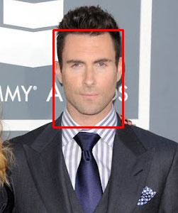

# Code Explanation

## Step 1
Reand the image and convert it into LAB color space

```python
import cv2

img = cv2.imread(imgPath + imgFilename)
size = img.shape
img_lab = cv2.cvtColor(img, cv2.COLOR_BGR2LAB)
```

## Step 2
Perform KMeans on AB dimension
```python
X = img_lab[:,:1:].reshape(size[0] * size[1], -1)
kmeans = Kmeans(n_clusters=k, random_state=42)
kmeans = kmeans.fit(X)
cls = kmeans.predict(X)   # get cluster index for each pixel
```

## Step 3
Calculate the cluster centers for each cluster in BGR space and find the cluster which is the closet
to the target vector.
```python
masks = [(cls == i) for i in range(k)]
cluster_means = []
for i, mask in enumerate(masks):
    cluster = img.reshape(size[0] * size[1], 3)[mask]
    cluster_means.append(cluster.mean(axis=0))

dits = []
for cluster_mean in cluster_means:
    dist = np.linalg.norm(cluster_mean - TARGET_COLOR, ord=2)
    dists.append(dist)

cluster_idx = np.argmin(dists)
mask = masks[cluster_idx].reshape(size[0], size[1], 1)
```
Here is the cluster found after KMeans  


## Step 4
Remove noise in the cluster using DBSCAN. Here, the input of DBSCAN algorithm 
is the coordinates of pixels, but not their color.  
**Note**: We need to specify the argument `eps=2**0.5` for DBSCAN. It is the maximum distance
between 2 samples for one to be considered as in the neighborhood of the other. Since the minimum 
coordinates distance in an image is $\sqrt{2}$, we should have `eps=2**0.5`.
```python
coords = []
for i in range(size[0]):
    for j in range(size[1]):
        if mask[i, j]:
            coords.append([i, j])
coords = np.array(coords)
db = DBSCAN(eps=2*0.5)
db.fit(coords)
face_coords = coords[db.labels_ == 0]
```
Here is the cluster after DBSCAN:  


## Step 5
Find and plot the bounding box

```python
import cv2

box = (np.min(face_coords[:, 1]),
       np.min(face_coords[:, 0]),
       np.max(face_coords[:, 0]),
       np.max(face_coords[:, 1]))
img_box = img.copy()
cv2.rectangle(img_box, [box[0], box[1]], [box[2], box[3]], color=(0,0,255), thickness=2)
```
Here is the bounding box:  
